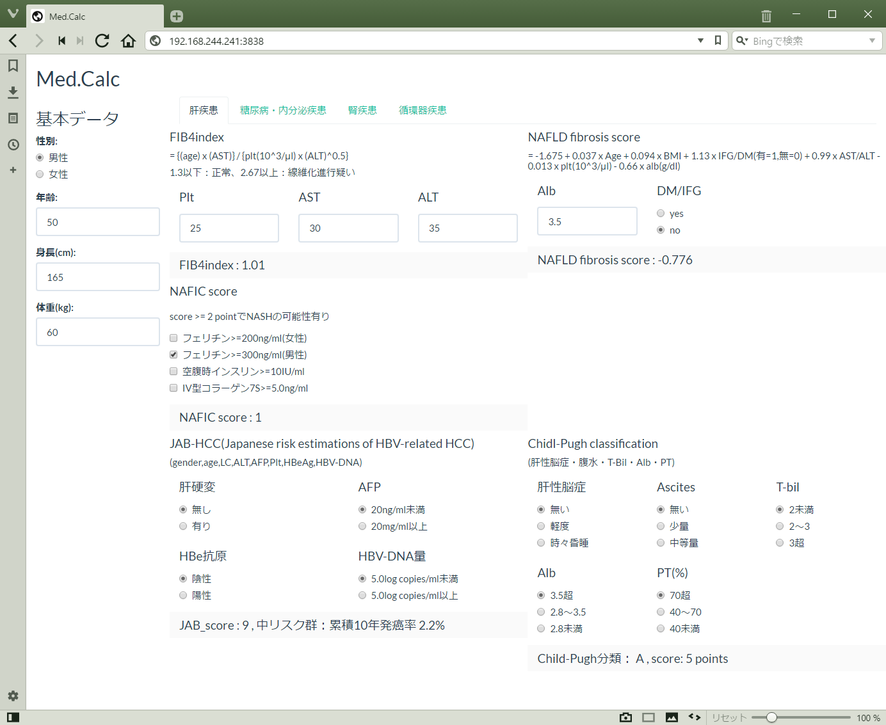

# MEDcal
肝疾患関連のスコアリング（Fib4index、NFS）、糖尿病関連の計算（HOMA-R等）のshinyアプリ

ローカル環境で使用する場合は、ダウンロードしてshinyファイルを実行するだけです。

shiny-serverが標準的な設定でインストールされている場合は、下記コードでインストールしてください。
```
rm -r /srv/shiny-server/*
cd /srv/shiny-server
wget https://raw.githubusercontent.com/Algo1970/medcal/master/ui.R
wget https://raw.githubusercontent.com/Algo1970/medcal/master/server.R
```

ブラウザから`<ip address>:3838`で接続できます。


